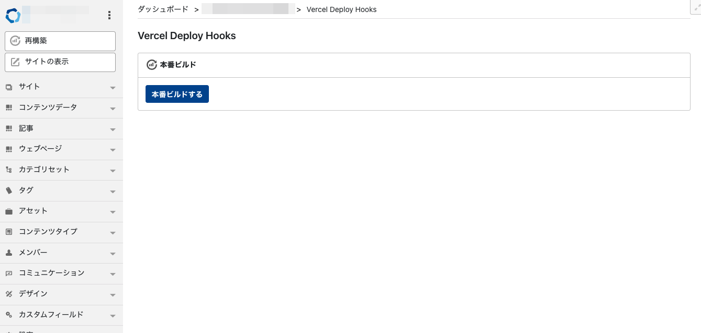
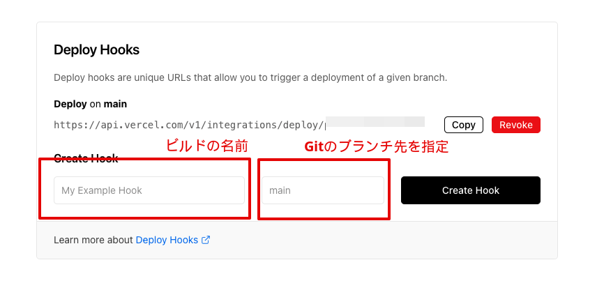
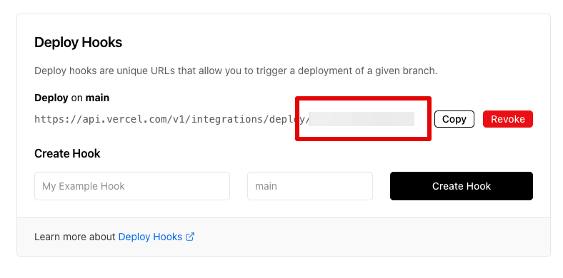
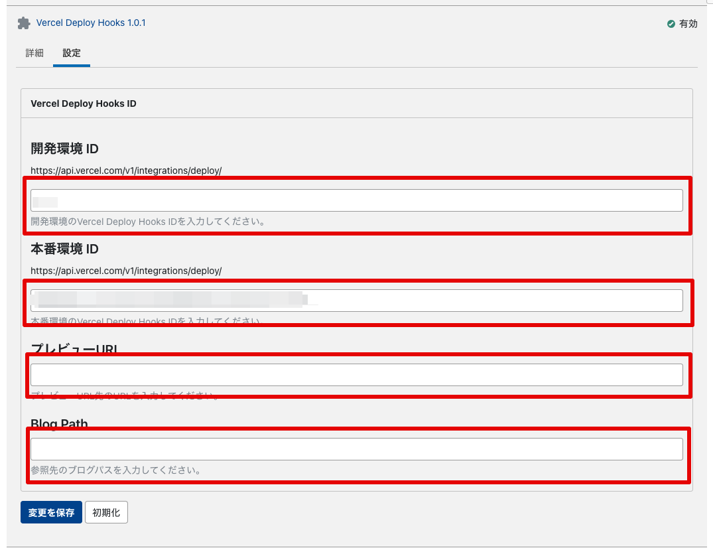
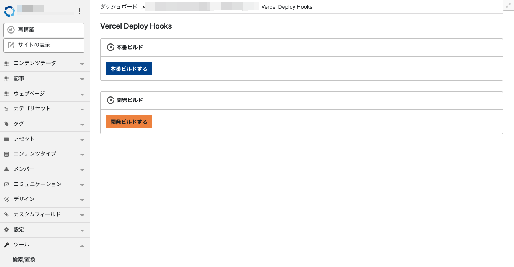

# mt-plugin-VercelDeployHooks

Vercel 管理画面にある Deploy Hooks を設定できるMTプラグインになります。  
Jamstackな構成を想定しています。

このプラグインで行えるのは、[Vercel](https://vercel.com/) 管理画面で設定できる Deploy Hooks を実行できるプラグインです。  
ホスティング先となる [Vercel](https://vercel.com/) で設定したHooksの値をMovable Type側で実行するこができます。

テンプレートは、MTMLを利用せずNext.jsを利用を想定しています。  
Movable TypeをData APIで取得し必要のファイル生成をJavaScriptで行う形を想定しています。
また、Next.jsで利用できる `PreviewMode` を活用することが可能です。

## Requirement

- Movable Type 7

## Installation

1. Unpack the mt-plugin-VercelDeployHooks archive.
1. Upload and copy the mt-plugin-VercelDeployHooks/plugins/VercelDeployHooks folder to your MT's plugins folder. ( /path/to/mt/plugins )

## How to use

### Setting

事前に、Next.jsをGitのリポジトリに設定しておきます。
また、[Vercel](https://vercel.com/) を利用するためアカウントの設定も事前に済ませておきましょう。

1. Vercelの管理画面にアクセスし設定したGitのリポジトリを設定します。
1. `Project Settings` の サイドメニューのGitを移動します。
1. Deploy Hooks に `Deploy Name` と `Branch` を定義する
1. 生成された Deploy HooksのURLを 保存する

1. 保存完了すると APIのURLが発行されます。
1. `https://api.vercel.com/v1/integrations/deploy/XXXX` の `XXXX` が Movable Type側で必要になるため保存

VercelDeployHooksプラグインのインストールは事前に済ませておきます。

1. 各自のMovable Typeにアクセス
1. VercelDeployHooksのプラグインは、サイト単位で設定するため各自のサイトへアクセス
1. サイトから左カラムの設定→プラグインをクリック
1. VercelDeployHooks をクリック
1. `https://api.vercel.com/v1/integrations/deploy/XXXX` でコピーした値を開発環境か本番環境どちらかに設定する
1. 保存

開発環境と本番環境で2つ設定することが可能です。  
また、Next.jsのPreviewModeを利用することが可能です。

- 開発環境IDは開発時に利用するDeploy Hooksの値を入力
- 本番環境IDは本番のDeploy Hooksの値を入力
- プレビューURLの値を入力
- BlogPathの値を入力

設定完了後、サイドメニューのツールから `Vercel` の画面に本番ビルドと開発ビルドのボタンが表示されます。  
ボタンをクリックすることで設定したDeploy Hooksが起動し `Vercel` 側でビルドが実行します。

### PreviewMode

Next.jsでは [PreviewMode](https://vercel.com/docs/concepts/next.js/preview-mode) という機能があります。  
この機能を利用することで、任意の記事データをプレビューで表示させることが可能になります。

公式ドキュメントに Movable Type 以外のCMSのExamplesが掲載されています。  
プレビュー機能自体は、Next.js側で処理させるため、このプラグインでは指定したURLを設定することで、プレビューボタンから設定したURLでプレビューを表示させることができます。
設定したURLで、PreviewModeで利用するサーバレス関数が起動しMovable Type側で定義した値をもとにData APIの情報でプレビューさせることが可能になります。

- プレビューURLは、ホスティング先URLとNext.jsの `preview` 関数起動先となるパスを入力する：Examples） `https://your.domain.com/api/preview`
- BlogPathは、 `preview` 関数起動後に取得した情報を元にページとして出力されているブログパスを入力する：） `/your_blog_path/`

#### Note

- PreviewModeは、ブログ記事のみ対応

## LoadMap

- コンテンツタイプ対応
- 予約ビルドの設定

## License

The MIT License (MIT)
